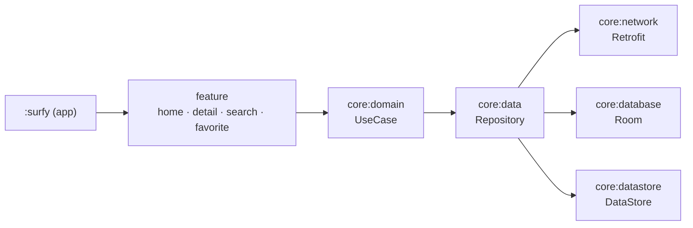

# Surfy 🎬

> **Movie surfing** — TMDB 데이터로 영화 · TV · 인물을 탐색하는 Android 앱


[Now in Android](https://github.com/android/nowinandroid)를 참고해 만든 Android 토이 프로젝트입니다.
[TMDB API](https://developer.themoviedb.org/reference/getting-started)로 콘텐츠를 탐색하고, 검색 · 상세 조회 · 즐겨찾기 · 주기적 동기화까지 앱 하나로 이어지는 흐름을 멀티 모듈 구조로 구현했습니다.

> 📌 이 브랜치는 **클린 아키텍처** (계층 구조) 버전입니다.

## 아키텍처 버전

같은 앱을 두 가지 구조로 구현해 브랜치별로 나눠 두었습니다.

| 구조                      | 설명                                    | 브랜치                                                                                                |
|-------------------------|---------------------------------------|----------------------------------------------------------------------------------------------------|
| 🟢 **클린 아키텍처** (현재 브랜치) | 화면 · 비즈니스 로직 · 데이터로 나누는 계층 구조         | [`clean_architecture`](https://github.com/KimBoWoon/surfy/tree/feature/clean_architecture)         |
| ⚪ api / impl 모듈 분리      | 모듈을 공개 계약(`api`)과 구현(`impl`)으로 나누는 구조 | [`feature/ryan_gradle_module`](https://github.com/KimBoWoon/surfy/tree/feature/ryan_gradle_module) |

## 스크린샷

|                     Home                      |                     Detail                      |                     Search                      |                     Favorite                      |
|:---------------------------------------------:|:-----------------------------------------------:|:-----------------------------------------------:|:-------------------------------------------------:|
|  |  |  |  |

## 주요 기능

| 기능           | 설명                         |
|--------------|----------------------------|
| **홈**        | 현재 상영작 / 개봉 예정작 / 트렌딩      |
| **검색**       | 영화 · TV · 인물 · 시리즈 통합 검색   |
| **상세**       | 영화 · TV · 인물 · 시리즈 상세 정보   |
| **즐겨찾기**     | 관심 콘텐츠 저장 및 목록 조회 (Room)   |
| **동기화**      | WorkManager 기반 주기적 데이터 동기화 |
| **딥링크 / 알림** | 푸시 알림 및 딥링크로 상세 화면 진입      |

## 기술 스택

| 분류           | 사용 기술                                                    |
|--------------|----------------------------------------------------------|
| Language     | Kotlin                                                   |
| UI           | Jetpack Compose, Material3, Coil                         |
| Architecture | Multi-module, MVVM, Clean Architecture                   |
| DI           | Hilt                                                     |
| Async        | Coroutines / Flow, RxKotlin (RxJava3) — 두 방식의 성능 비교 진행 중 |
| Network      | Retrofit2, OkHttp, Kotlinx Serialization                 |
| Storage      | Room, DataStore (Proto)                                  |
| Background   | WorkManager                                              |
| Firebase     | Analytics, Crashlytics, FCM, App Distribution            |
| Build        | Gradle Kotlin DSL, `build-logic` (convention plugins)    |

## 아키텍처

의존 방향은 `feature → domain → data → network / database / datastore` 입니다.



| 계층          | 역할                                     |
|-------------|----------------------------------------|
| **Feature** | 화면 상태 관리(ViewModel)와 Compose UI        |
| **Domain**  | 여러 Repository를 조합하는 비즈니스 로직(UseCase)   |
| **Data**    | 네트워크 / 로컬 데이터 소스를 통합하는 Repository 구현   |
| **Infra**   | Room, DataStore, WorkManager, Firebase |

## 모듈 구조

```
Surfy
├── surfy                  # 앱 진입점 (MainActivity, 앱 상태, 초기화)
├── feature
│   ├── home               # 홈 화면
│   ├── detail             # 상세 화면
│   ├── search             # 검색 화면
│   └── favorite           # 즐겨찾기 화면
├── core
│   ├── model              # 도메인 모델
│   ├── domain             # UseCase
│   ├── data               # Repository 구현
│   ├── network            # TMDB 네트워크 계층 (Retrofit, Serialization)
│   ├── database           # Room DB
│   ├── datastore          # DataStore (사용자 설정)
│   ├── datastore-test     # DataStore 테스트 지원
│   ├── sync               # WorkManager 기반 동기화
│   ├── notifications      # 알림 / 딥링크
│   ├── firebase           # Firebase 연동
│   ├── analytics          # 분석 이벤트
│   ├── ui                 # 공통 Compose UI
│   ├── common             # 공통 유틸
│   └── testing            # 테스트 공용 코드
├── benchmark              # Macrobenchmark
└── build-logic            # Convention plugins
```

## 성능 비교 (RxKotlin vs Coroutines)

`:benchmark` 모듈의 Macrobenchmark로 RxKotlin(RxJava3)과 Coroutines / Flow 구현의 메모리 사용량을 비교하고 있습니다. (진행 중)

## 시작하기

### 1. 요구 사항

- JDK 17
- Android SDK / Android Studio
- [TMDB API 키](https://developer.themoviedb.org/reference/getting-started)

### 2. 시크릿 파일 준비

API 키와 서명 정보는 `./sign/local.properties`에서 읽습니다. 이 파일은 저장소에 커밋하지 마세요.

```properties
tmdb_open_api_key=YOUR_TMDB_KEY
store_file_path=./sign/your_keystore.jks
store_password=******
key_alias=******
key_password=******
```

Firebase를 사용하려면 `surfy/google-services.json`도 함께 준비합니다.

### 3. 빌드 및 테스트

```bash
# 디버그 빌드
./gradlew assembleProdDebug

# 단위 테스트
./gradlew testProdReleaseUnitTest
```

## CI/CD

GitHub Actions로 운영합니다.

| 트리거                         | 동작                            |
|-----------------------------|-------------------------------|
| Pull Request                | 빌드 및 단위 테스트 실행                |
| `master`, `release/**` push | Firebase App Distribution 업로드 |

## 라이선스

이 프로젝트는 [MIT License](LICENSE)를 따릅니다.

## 개발자

- Android: [김보운](https://github.com/KimBoWoon)

---