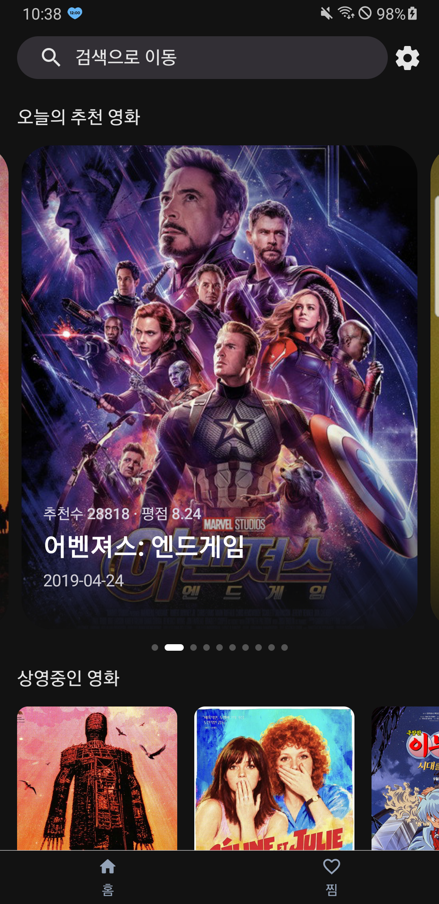
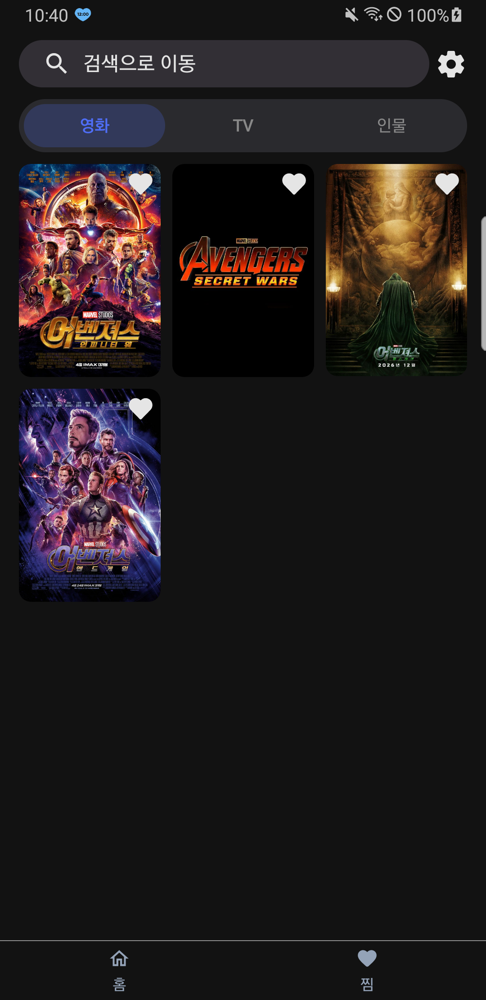
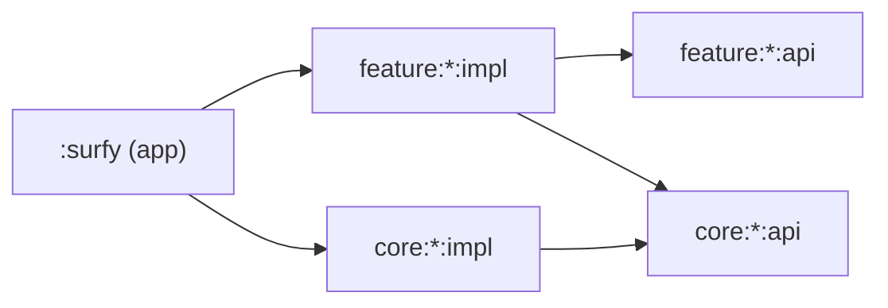

# Surfy 🎬

> **Movie surfing** — TMDB 데이터로 영화 · TV · 인물을 탐색하는 Android 앱


[Now in Android](https://github.com/android/nowinandroid)를 참고해 만든 Android 토이 프로젝트입니다.
[TMDB API](https://developer.themoviedb.org/reference/getting-started)로 콘텐츠를 탐색하고, 검색 · 상세 조회 · 즐겨찾기 · 주기적 동기화까지 앱 하나로 이어지는 흐름을 멀티 모듈 구조로 구현했습니다.

> 📌 이 브랜치는 **api / impl 모듈 분리** 버전입니다.

## 아키텍처 버전

같은 앱을 두 가지 구조로 구현해 브랜치별로 나눠 두었습니다.

| 구조                               | 설명                                    | 브랜치                                                                                                |
|----------------------------------|---------------------------------------|----------------------------------------------------------------------------------------------------|
| ⚪ 클린 아키텍처                        | 화면 · 비즈니스 로직 · 데이터로 나누는 계층 구조         | [`clean_architecture`](https://github.com/KimBoWoon/surfy/tree/clean_architecture)                 |
| 🟢 **api / impl 모듈 분리** (현재 브랜치) | 모듈을 공개 계약(`api`)과 구현(`impl`)으로 나누는 구조 | [`feature/ryan_gradle_module`](https://github.com/KimBoWoon/surfy/tree/feature/ryan_gradle_module) |

## 스크린샷
|                     Home                      |                     Detail                      |                     Search                      |                     Favorite                      |
|:---------------------------------------------:|:-----------------------------------------------:|:-----------------------------------------------:|:-------------------------------------------------:|
|  |  |  |  |

## 주요 기능

| 기능           | 설명                         |
|--------------|----------------------------|
| **홈**        | 현재 상영작 / 개봉 예정작 / 트렌딩      |
| **검색**       | 영화 · TV · 인물 · 시리즈 통합 검색   |
| **상세**       | 영화 · TV · 인물 · 시리즈 상세 정보   |
| **즐겨찾기**     | 관심 콘텐츠 저장 및 목록 조회 (Room)   |
| **동기화**      | WorkManager 기반 주기적 데이터 동기화 |
| **딥링크 / 알림** | 푸시 알림 및 딥링크로 상세 화면 진입      |

## 기술 스택

| 분류           | 사용 기술                                                    |
|--------------|----------------------------------------------------------|
| Language     | Kotlin                                                   |
| UI           | Jetpack Compose, Material3, Coil                         |
| Architecture | Multi-module (api / impl), MVVM                          |
| DI           | Hilt                                                     |
| Async        | Coroutines / Flow, RxKotlin (RxJava3) — 두 방식의 성능 비교 진행 중 |
| Network      | Retrofit2, OkHttp, Kotlinx Serialization                 |
| Storage      | Room, DataStore (Proto)                                  |
| Background   | WorkManager                                              |
| Firebase     | Analytics, Crashlytics, FCM, App Distribution            |
| Build        | Gradle Kotlin DSL, `build-logic` (convention plugins)    |

## 아키텍처

[Ryan Harter](https://ryanharter.com/blog/2026/07/a-great-gradle-module-structure/)의 api/impl 모듈 구조를 참고해, 모듈을 공개 계약(`api`)과 구현(`impl`)으로 나눕니다.
모듈 간 의존은 `api`로만 연결해 구현 세부사항이 다른 모듈로 새지 않게 하고, `api`가 바뀌지 않는 `impl` 수정은 다운스트림 모듈의 재컴파일을 일으키지 않아 증분 빌드에도 유리합니다.



| 대상                                                          | 구성                                                                                                           |
|-------------------------------------------------------------|--------------------------------------------------------------------------------------------------------------|
| feature 모듈                                                  | `:feature:<name>:api` + `:feature:<name>:impl`<br/>`detail`은 movie / tv / people / series를 별도 모듈이 아닌 패키지로 유지 |
| `core:userdata`, `core:network`                             | api / impl 분리                                                                                                |
| `core:database`                                             | api 없이 impl을 직접 공유                                                                                           |
| `core:model`, `core:common`, `core:ui`, `core:designsystem` | 분리하지 않음                                                                                                      |

## 모듈 구조

```
Surfy
├── surfy                  # 앱 진입점 (MainActivity, 앱 상태, 초기화)
├── feature
│   ├── home
│   │   ├── api            # 화면 진입 계약 (route, navigation)
│   │   └── impl           # 화면 구현 (ViewModel, Compose UI)
│   ├── detail
│   │   ├── api
│   │   └── impl           # movie · tv · people · series 패키지
│   ├── search
│   │   ├── api
│   │   └── impl
│   └── favorite
│       ├── api
│       └── impl
├── core
│   ├── model              # 도메인 모델
│   ├── userdata
│   │   ├── api            # Repository 인터페이스
│   │   └── impl           # Repository 구현
│   ├── network
│   │   ├── api            # 데이터 소스 인터페이스
│   │   └── impl           # Retrofit, Serialization
│   ├── database           # Room DB (api 없이 impl 직접 공유)
│   ├── designsystem       # 디자인 시스템
│   ├── ui                 # 공통 Compose UI
│   └── common             # 공통 유틸
├── benchmark              # Macrobenchmark
└── build-logic            # Convention plugins
```

## 성능 비교 (RxKotlin vs Coroutines)

`:benchmark` 모듈의 Macrobenchmark로 RxKotlin(RxJava3)과 Coroutines / Flow 구현의 메모리 사용량을 비교하고 있습니다. (진행 중)

## 시작하기

### 1. 요구 사항

- JDK 17
- Android SDK / Android Studio
- [TMDB API 키](https://developer.themoviedb.org/reference/getting-started)

### 2. 시크릿 파일 준비

API 키와 서명 정보는 `./sign/local.properties`에서 읽습니다. 이 파일은 저장소에 커밋하지 마세요.

```properties
tmdb_open_api_key=YOUR_TMDB_KEY
store_file_path=./sign/your_keystore.jks
store_password=******
key_alias=******
key_password=******
```

Firebase를 사용하려면 `surfy/google-services.json`도 함께 준비합니다.

### 3. 빌드 및 테스트

```bash
# 디버그 빌드
./gradlew assembleProdDebug

# 단위 테스트
./gradlew testProdReleaseUnitTest
```

## CI/CD

GitHub Actions로 운영합니다.

| 트리거                         | 동작                            |
|-----------------------------|-------------------------------|
| Pull Request                | 빌드 및 단위 테스트 실행                |
| `master`, `release/**` push | Firebase App Distribution 업로드 |

## 라이선스

이 프로젝트는 [MIT License](LICENSE)를 따릅니다.

## 개발자

- Android: [김보운](https://github.com/KimBoWoon)